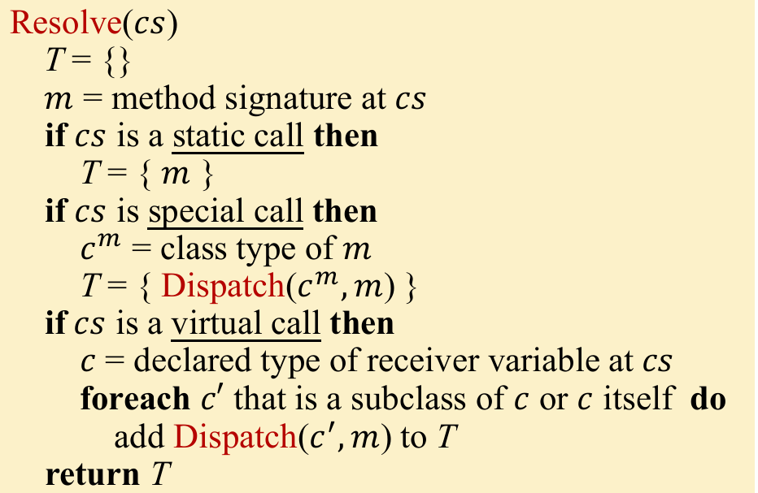

# 作业4：类层次结构分析与过程间常量传播

这一部分的作业我觉得代码量是非常非常大的，相比于前面的作业大了许多，而且包含了一些课程没有直接讲述的内容，但是其实仔细想一想也能自己领悟出来的部分

对于不熟悉的类，或者想要了解有什么满足特定功能的 api ， 可以访问 tai-e 的官方 api 文档 ： [官方 API 文档](https://tai-e.pascal-lab.net/docs/0.5.2/api/index.html)


## `CHABuilder`

### `dispatch`

我们首先完成最简单的 `dispatch` 函数， 具体的原理如下： 


`m` , `c` 可以通过对应的函数获取

```java
private JMethod dispatch(JClass jclass, Subsignature subsignature) {
    // TODO - finish me
    if(jclass == null) return null;
    JMethod m = jclass.getDeclaredMethod(subsignature);
    if(m != null) return m;
    return dispatch(jclass.getSuperClass(), subsignature);
}
```

### `resolve`

接下来完成 `resolve` 函数



对于 `STATIC` 和 `SPECIAL` 类型的调用， 我们统计使用 `dispatch` 函数即可

比较复杂的 `VIRTUAL` 和 `INTERFACE`, 但其实他们都属于同一类的调用， 我们需要找到他们的所有子类，在寻找子类这一部分，`interface` 和 `class` 就要很大的区别了

* `interface` ： 对于一个接口来说，继承他的有两种可能，一个是子接口，一个是类，有两个分支，我们都需要进行包含， 所以要使用 `getDirectImplementorsOf` 和 `getDirectSubinterfacesOf`
* `class` : 对于类来说，只有类可以继承， 所以是单分支，使用 `getDirectSubclassesOf` 函数即可

同时因为类的继承关系具有嵌套和深度的关系，所以我们可以使用 BFS 来便利

寻找到所有的继承子类之后，就可以调用 `dispatch` 来获取了

```java
private Set<JMethod> resolve(Invoke callSite) {
    // TODO - finish me
    Set<JMethod> res = new HashSet<>();

    switch (CallGraphs.getCallKind(callSite)) {
        case STATIC : {}
        case SPECIAL : { 
            JMethod m = dispatch(callSite.getMethodRef().getDeclaringClass(),
                callSite.getMethodRef().getSubsignature());
            if(m != null) res.add(m);
            break;
        }
        case VIRTUAL : {}
        case INTERFACE : {
            Set<JClass> subClasses = new HashSet<>();
            subClasses.add(callSite.getMethodRef().getDeclaringClass());

            Queue<JClass> workList = new ArrayDeque<>();
            workList.add(callSite.getMethodRef().getDeclaringClass());
            while(! workList.isEmpty()) {
                JClass head = workList.poll();
                if(head.isInterface()) {
                    hierarchy.getDirectImplementorsOf(head).forEach(obj -> {
                        subClasses.add(obj);
                        workList.add(obj);
                    });
                    hierarchy.getDirectSubinterfacesOf(head).forEach(obj -> {
                        subClasses.add(obj);
                        workList.add(obj);
                    });
                } else {
                    hierarchy.getDirectSubclassesOf(head).forEach(obj -> {
                        subClasses.add(obj)
                        workList.add(obj);
                    });
                }
            }
            for(JClass cls : subClasses) {
                JMethod m = dispatch(cls, callSite.getMethodRef().getSubsignature());
                if(m == null || m.isAbstract()) continue;
                res.add(m);
            }
        }
    }

    return res;
}
```

### `buildCallGraph`

这一个函数不难， 按照教程中的方式一一实现即可, 注意 RM 要在 DefaultCallGraph 里面更新即可，不要自定义

```java
private CallGraph<Invoke, JMethod> buildCallGraph(JMethod entry) {
    DefaultCallGraph callGraph = new DefaultCallGraph();
    callGraph.addEntryMethod(entry);
    // TODO - finish me
    Queue<JMethod> workList = new ArrayDeque<>();
    workList.add(entry);
    while(! workList.isEmpty()) {
        JMethod head = workList.poll();
        if(callGraph.contains(head)) continue;
        callGraph.addReachableMethod(head);
        Set<Invoke> callSites = callGraph.getCallSitesIn(head);
        for(Invoke c : callSites) {
            Set<JMethod> to_method = resolve(c);

            for (JMethod method : to_method) {
                callGraph.addEdge(determindCallSiteEdge(c, method));
                workList.add(method);
            }
        }
    }

    return callGraph;
}
```

## `InterConstantPropagation`

### `Edge transfer function`

我们先完成所有类型的 Edge Transfer Function, Edge 的类型分为四种：（摘自官方说明）

* Normal edge: 这种边一般是与过程间调用无关的边，edge transfer 函数不需要对此进行特殊的处理。这种边上的 fact 经 transfer edge 之后不会有任何改变。换句话说，此时 edge transfer 是一个恒等函数，即 transferEdge(edge, fact) = fact。
* Call-to-return edge: 对于方法调用 x = m(…)，edge transfer 函数会把等号左侧的变量和它的值从 fact 中kill 掉。而对于等号左侧没有变量的调用，比如 m(…)，edge transfer 函数的处理方式与对待 normal edge 的一致：不修改 fact，edge transfer 是一个恒等函数。
* Call edge: 对于这种边，edge transfer 函数会将实参（argument）在调用点中的值传递给被调用函数的形参（parameter）。具体来说，edge transfer 首先从调用点的 OUT fact 中获取实参的值，然后返回一个新的 fact，这个 fact 把形参映射到它对应的实参的值。此时，edge transfer 函数的返回值应该仅包含被调用函数的形参的值（比如图 1 里，addOne() 的 x）。
* Return edge: edge transfer 函数将被调用方法的返回值传递给调用点等号左侧的变量。具体来说，它从被调用方法的 exit 节点的 OUT fact 中获取返回值（可能有多个，你需要思考一下该怎么处理），然后返回一个将调用点等号左侧的变量映射到返回值的 fact。此时，edge transfer 函数返回的结果应该仅包含调用点等号左侧变量的值（例如图1在第三条语句处的b）。如果该调用点等号左侧没有变量，那么 edge transfer 函数仅会返回一个空 fact。

我们对应四个类型的变一一实现即可：

```java
protected CPFact transferNormalEdge(NormalEdge<Stmt> edge, CPFact out) {
    // TODO - finish me
    return out.copy();
}

@Override
protected CPFact transferCallToReturnEdge(CallToReturnEdge<Stmt> edge, CPFact out) {
    // TODO - finish me
    Stmt source = edge.getSource();
    CPFact res = out.copy();
    source.getDef()
            .filter(def -> def instanceof Var)
            .map(def -> (Var) def)
            .filter(ConstantPropagation::canHoldInt)
            .ifPresent(var -> res.update(var, Value.getUndef()));
    return res;
}

@Override
protected CPFact transferCallEdge(CallEdge<Stmt> edge, CPFact callSiteOut) {
    // TODO - finish me
    Stmt source = edge.getSource(), target = edge.getTarget();
    CPFact res = new CPFact();
    IR ir = icfg.getContainingMethodOf(target).getIR();
    List<Var> fval = ir.getParams();
    if (!(source instanceof Invoke)) {
        return res;
    }
    Invoke invokeStmt = (Invoke)source;
    List<Var> cval = invokeStmt.getRValue().getArgs();
    for(int i = 0 ; i < cval.size() ; i ++) {
        Var param = fval.get(i);
        if (ConstantPropagation.canHoldInt(param)) {
            res.update(param, callSiteOut.get(cval.get(i)));
        }
    }
    return res;
}

@Override
protected CPFact transferReturnEdge(ReturnEdge<Stmt> edge, CPFact returnOut) {
    // TODO - finish me
    CPFact res = new CPFact();
    Stmt callSite = edge.getCallSite();
    callSite.getDef()
            .filter(def -> def instanceof Var)
            .map(def -> (Var) def)
            .filter(ConstantPropagation::canHoldInt)
            .ifPresent(var -> {
                Value val = Value.getUndef();
                for (Var returnVar : edge.getReturnVars()) {
                    val = cp.meetValue(val, returnOut.get(returnVar));
                }
                res.update(var, val);
            });
    return res;
}
```

### `transferNode`

处理调用点和非调用点的transfer function 其实也很简单，原理如下：
* 调用点： 不会有更新，直接让 out = in 即可
* 非调用点： 调用普通的常量传播的 transfer function即可

代码如下：

```java
@Override
protected boolean transferCallNode(Stmt stmt, CPFact in, CPFact out) {
    // TODO - finish me
    CPFact oldOut = out.copy();
    out.clear();
    out.copyFrom(in);
    return !out.equals(oldOut);
}

@Override
protected boolean transferNonCallNode(Stmt stmt, CPFact in, CPFact out) {
    // TODO - finish me
    return cp.transferNode(stmt, in, out);
}
```

## `InterSolver`

### `initialize`

初始化的代码和之前类似，但有一点我也不理解：原文档里面说：
> 在初始化的过程中，过程间求解器需要初始化程序中所有的 IN/OUT fact，也就是 ICFG 的全部节点。但你仅需要对 ICFG 的 entry 方法（比如 main 方法）的 entry 节点设置 boundary fact。这意味着其他方法的 entry 节点和非 entry 节点的初始 fact 是一样的。

但实际上你不知道怎么获取第一个 entry 节点，看了科研版的实现，发现是直接吧所有的entry都初始化为boundary

```java
private void initialize() {
    // TODO - finish me
    for(Node node : icfg) {
        result.setInFact(node, analysis.newInitialFact());
        result.setOutFact(node, analysis.newInitialFact());
    }
    Set<Node> boundaryNodes = icfg.entryMethods()
            .map(m -> icfg.getEntryOf(m))
            .collect(Collectors.toSet());
    boundaryNodes.forEach(n -> {
        result.setInFact(n, analysis.newBoundaryFact(n));
        result.setOutFact(n, analysis.newBoundaryFact(n));
    });
}
```

### `doSolve`

逻辑和原本的 worklist 是一致的，只不过对比普通的 worklist， 我们需要对 icfg 的每一个边调用 Edge transfer， 之后在 meet

out fact 则需要调用 `transferNode` ， 里面对调用点和非调用点做了区分 

```java
private void doSolve() {
    // TODO - finish me
    workList = new ArrayDeque<>();
    for(Node node : icfg) {
        workList.add(node);
    }
    Set<Node> boundaryNodes = icfg.entryMethods()
            .map(m -> icfg.getEntryOf(m))
            .collect(Collectors.toSet());
    while(!workList.isEmpty()) {
        Node head = workList.poll();
        // IN FACT
        Set<ICFGEdge<Node>> inEdge = icfg.getInEdgesOf(head);
        Fact in = boundaryNodes.contains(head) ? analysis.newBoundaryFact(head) : analysis.newInitialFact();
        for (ICFGEdge<Node> pred : inEdge) {
            Fact newOut = analysis.transferEdge(pred, result.getOutFact(pred.getSource()));
            analysis.meetInto(newOut, in);
        }
        result.setInFact(head, in);

        // OUT FACT
        if (analysis.transferNode(head, result.getInFact(head), result.getOutFact(head))) {
            for (Node succ : icfg.getSuccsOf(head)) {
                workList.add(succ);
            }
        }
    }
}
```
