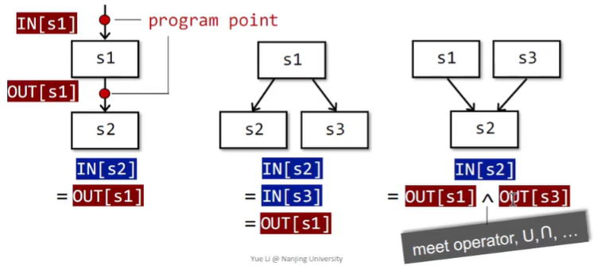
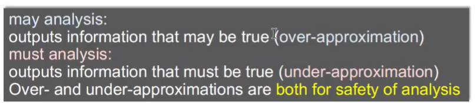
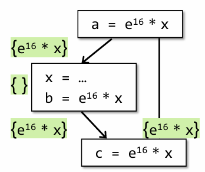

# Data Flow Analysis Application


这一章关注的问题是：**抽象信息究竟是怎样沿着程序的控制流传播的。**

课程中把数据流分析描述为：在控制流图 `CFG` 上传播抽象事实，并通过迭代求得程序各点的分析结果。不同的数据流分析虽然目标不同，但它们共用同一套基本框架。

## 数据流分析基本原理

程序执行时，数据会随着控制流在不同语句、不同基本块之间流动。静态分析要做的，就是在不真正运行程序的前提下，近似刻画这种流动。

通常我们会在每个程序点维护两类信息：

- `IN[B]`：进入基本块 `B` 之前的抽象信息
- `OUT[B]`：离开基本块 `B` 之后的抽象信息

这里的“抽象信息”是什么，要看具体分析目标：

- 在 `Reaching Definitions` 中，它表示“哪些定义可能到达这里”
- 在 `Live Variable Analysis` 中，它表示“哪些变量在这里是活跃的”
- 在 `Available Expressions` 中，它表示“哪些表达式在这里已经可用”

因此，数据流分析并不是分析某个具体值，而是在分析某种性质如何沿着 `CFG` 传播。

## 三种基本传播场景

在 `CFG` 上，抽象信息的传播可以概括为三种情况：

- 顺序执行：一个节点的输出直接成为后继节点的输入，即 $\text{IN[S}_2\text{]} = \text{OUT[S}_1\text{]}$。
- 分支发散：一个节点的输出同时流向多个后继，即 $\text{IN[S}_2\text{]} = \text{IN[S}_3\text{]} = \text{OUT[S}_1\text{]}$。
- 路径汇合：多个前驱节点的输出在某个点合并成该点输入，即 $\text{IN[S]} = \bigvee (\text{OUT[P}_1\text{]}, \text{OUT[P}_2\text{]}, \dots)$。

这里的 $\vee$ 不是固定运算，它由分析本身决定：

- 有的分析在汇合处取并集
- 有的分析在汇合处取交集

这正是 `may analysis` 和 `must analysis` 的关键区别。



## May Analysis 和 Must Analysis

- `may analysis`：只要程序执行路径中存在一条路径可以到达某个状态 $A$，那么就认为 $A$ 可能发生。它本质上是一种 `over-approximation`。优点是不容易漏报，但可能会报出实际不会发生的情况。
- `must analysis`：只有当所有路径都可以到达某个状态 $A$ 时，才认为 $A$ 一定发生。它更接近一种保守确认，结果更强，但可能漏掉只在部分路径上成立的性质。

一般情况下，`may` 倾向于配合并集，`must` 倾向于配合交集。初始化时，也常常把 `may` 看成从空集开始，把 `must` 看成从全集开始。



## 前向传播和反向传播

- `Forward Analysis`：从前向后分析，即 $\text{IN[B]} \rightarrow \text{OUT[B]}$
- `Backward Analysis`：从后向前分析，即 $\text{OUT[B]} \rightarrow \text{IN[B]}$

前向分析通常回答“过去发生了什么会影响现在”，反向分析通常回答“现在的值在未来是否还重要”。

## 基本数据流方程

一个典型的数据流分析通常包含两部分：

- 控制流约束：描述信息如何在 `CFG` 上从前驱或后继传播
- 传递函数：描述一个基本块内部如何改变抽象信息

一般写成 $\text{OUT[B]} = f_B(\text{IN[B]})$，如果是后向分析，也可以写成 $\text{IN[B]} = f_B(\text{OUT[B]})$。

其中 `f_B` 就是基本块 `B` 的 `transfer function`。如果把一个基本块内部看成若干条顺序语句 $s_1, s_2, \dots, s_n$，那么整个块的传递函数本质上是这些语句传递函数的复合，即 
$$
f_B = f_{s_n} \circ \dots \circ f_{s_2} \circ f_{s_1}
$$

这也是为什么课程里常说：数据流分析既可以在基本块级别做，也可以在语句级别做。前者效率更高，后者更精细。


## Iterative Algorithm

课程给出的求解思路是：不断迭代，直到达到不动点。

基本步骤通常是：

- 初始化所有基本块的 `IN/OUT`
- 反复按照数据流方程更新
- 如果某一轮更新后结果不再变化，就停止

```text
initialize IN/OUT
repeat
    changed = false
    for each block B:
        old = OUT[B] or IN[B]
        recompute
        if result changed:
            changed = true
until not changed
```

之所以能够收敛，是因为经典 bit-vector 分析通常建立在有限集合上，并且更新过程是单调的，因此最终会达到稳定状态。


##  三种常见的数据流分析


### Reaching Definitions

**定义**

若变量 `x` 的某次定义 `d` 沿着某条路径可以到达程序点 `p`，并且路径上没有对 `x` 的重新定义，那么称定义 `d` `reaches` `p`。如果路径中间又出现了对 `x` 的新定义，那么旧定义就被 `kill` 了。

这个分析是 `may analysis` 的， 并且使用前向传播


**数据流方程**

* 控制流约束为 $\text{IN[B]} = \bigcup_{\text{P} \in \text{pred(B)}} \text{OUT[P]}$
* 传递函数为 $\text{OUT[B]} = \text{gen[B]} \cup (\text{IN[B]} - \text{kill[B]})$。
    > 其中：
    > - `gen[B]`：块 `B` 中产生的定义
    > - `kill[B]`：块 `B` 中会覆盖掉的其他同变量定义

**用途**

- 检查某个使用点可能来自哪些定义
- 帮助发现未定义使用等问题


### Live Variable Analysis

**定义**

变量 `x` 在程序点 `p` 是活跃的，指的是：从 `p` 出发存在一条路径，在这条路径上 `x` 的当前值将来会被使用，并且在此之前不会被重新定义。

这个分析是 `may analysis` 的， 并且使用反向传播


**数据流方程**

* 控制流约束为 $\text{OUT[B]} = \bigcup_{\text{S} \in \text{succ(B)}} \text{IN[S]}$
* 传递函数为 $\text{IN[B]} = \text{use[B]} \cup (\text{OUT[B]} - \text{def[B]})$。
    > 其中：
    > - `use[B]`：块内先于定义发生的使用
    > - `def[B]`：块内定义的变量

**直观理解**

如果一个变量在块中被使用，那么它在进入该块前必须是活跃的。  
如果一个变量虽然在后续活跃，但在当前块里已经被重新定义，那么旧值就不再活跃。

**用途**

这是寄存器分配中最经典的分析之一：

- 活跃变量需要继续保存在寄存器中
- 不再活跃的变量对应寄存器可以释放

### Available Expressions

**定义**

表达式 `x + y` 在程序点 `p` 是 available 的，指的是：从程序入口到 `p` 的所有路径上，这个表达式都已经被计算过，并且自最后一次计算之后，它的操作数没有被重新定义。

这个分析是 `must analysis` 的， 并且使用前向传播

**数据流方程**

* 控制流约束为 $\text{IN[B]} = \bigcap_{\text{P} \in \text{pred(B)}} \text{OUT[P]}$
* 传递函数为 $\text{OUT[B]} = \text{gen[B]} \cup (\text{IN[B]} - \text{kill[B]})$。
    > 其中：
    > - `gen[B]`：块中计算出的新表达式
    > - `kill[B]`：块中由于变量被重新赋值而失效的表达式

**用途**

它最典型的用途是：

- `Common Subexpression Elimination, CSE`

如果一个表达式在当前点可用，那么就没有必要重新计算，可以直接复用之前的结果。

这里的“可用”并不代表里面变量的值没变，而是代表 “当前的表达式已经被算过了”，直接使用即可：

举个例子：




虽然 $x$ 的值在分支中发生了变化，但是当要计算 $c$ 的时候， $e^{16} \times x$ 是计算出来的，不需要继续进行计算了

## 三种经典分析的对比

把这三种分析放在一起看，会更容易记住课程中的统一框架：

| Analysis | Direction | Kind | Merge |
|---|---|---|---|
| Reaching Definitions | Forward | May | Union |
| Live Variables | Backward | May | Union |
| Available Expressions | Forward | Must | Intersection |

可以看到：

- `may` 往往配并集
- `must` 往往配交集
- “由过去决定现在”的分析通常前向
- “由未来反推现在”的分析通常后向

当然，这并不是死规定，但对课程中的经典 `bit-vector analysis` 来说非常常见。
