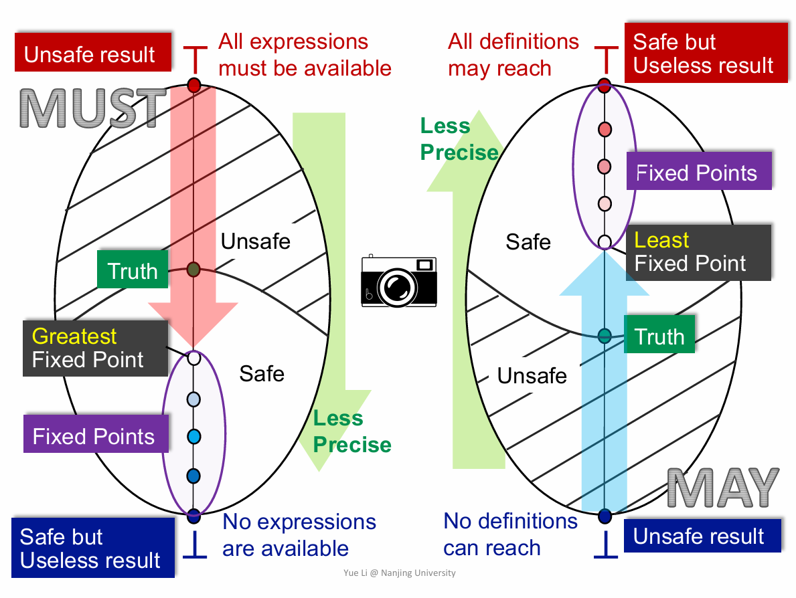
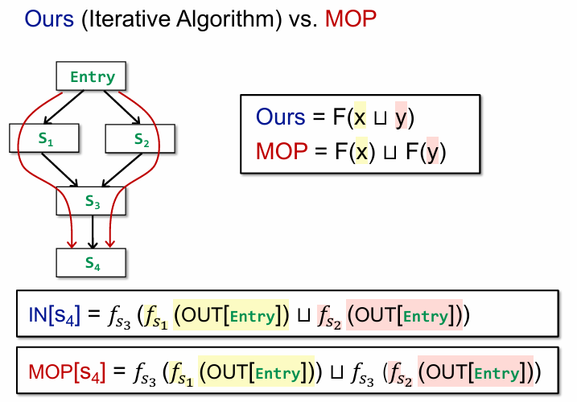
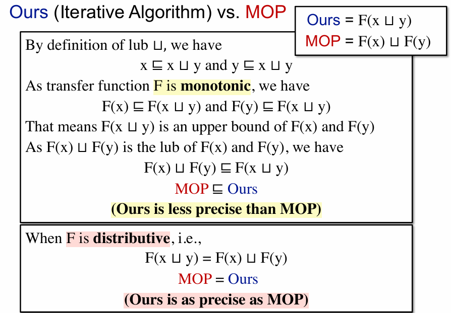

# Data Flow Analysis Theory

前一章讨论的是数据流分析“怎么用”，这一章讨论的是它“为什么能算出来、为什么会收敛、为什么这个结果有意义”。

课程里常把这一部分概括为：把程序分析问题转化为格上的单调函数求不动点问题。

## 1. 数据流分析迭代算法框架 $F: V^k \rightarrow V^k$

设程序里一共有 $k$ 个需要维护分析结果的点，且每个点上的抽象值都来自同一个值域 $V$。那么所有程序点的分析结果可以打包成一个向量
$X = (x_1, x_2, \dots, x_k) \in V^k$。

这样一来，一轮“按照数据流方程更新所有点”的过程，就不再只是很多局部赋值，而可以统一看成一个全局函数
$F : V^k \rightarrow V^k$。

也就是说：

- 输入是当前整张 `CFG` 上的分析结果
- 输出是更新一轮之后的新结果

于是朴素迭代算法就可以写成：

```text
X0, X1 = F(X0), X2 = F(X1), ...
```

如果某一步出现 $X_i = F(X_i)$，那么就称 $X_i$ 是 `fixed point`，也就是不动点。此时再继续迭代，结果也不会变化。


## 2. 偏序关系

为了讨论“迭代是朝哪个方向走的”“结果谁比谁更精确”，我们需要先引入偏序关系。

集合 $L$ 上的一个关系 $\sqsubseteq$ 如果满足下面三个性质，就称 $(L, \sqsubseteq)$ 是一个 `partially ordered set, poset` 偏序集：

- 自反性：$x \sqsubseteq x$
- 反对称性：若 $x \sqsubseteq y$ 且 $y \sqsubseteq x$，则 $x = y$
- 传递性：若 $x \sqsubseteq y$ 且 $y \sqsubseteq z$，则 $x \sqsubseteq z$

在静态分析里，$\sqsubseteq$ 往往表示“信息量不超过”或者“精度不高于”。

例如在 `may analysis` 里，如果用集合表示“可能发生的事实”，那么常见的偏序就是集合包含关系 $\subseteq$：

- 集合越小，通常越精确
- 集合越大，通常越保守

> 如果某些时候不理解 $\sqsubseteq$ 符号，可以使用 $\le$ 来替代


## 3. 偏序集上的上界和下界

在偏序集中，给定一个子集 $S \subseteq L$：

- 若对任意 $x \in S$ 都有 $x \sqsubseteq u$，则称 $u$ 是 $S$ 的 `upper bound`
- 若对任意 $x \in S$ 都有 $l \sqsubseteq x$，则称 $l$ 是 $S$ 的 `lower bound`

如果一个上界本身不大于任何其他上界，那么它就是 `least upper bound, lub`（最小上界），也叫 `join`，常记为 $\mathrm{lub}(S)$。 

类似地，如果一个下界本身不小于任何其他下界，那么它就是 `greatest lower bound, glb`（最大下界），也叫 `meet`，常记为 $\mathrm{glb}(S)$。

在数据流分析里，控制流汇合点正是依赖这些运算来合并信息：

- `may analysis` 常用 `join`
- `must analysis` 常用 `meet`

所以“汇合操作”本质上不是语法规则，而是偏序结构上的上界或下界运算。

## 4. 格（Lattice）与全格（Complete Lattice）

如果一个偏序集里任意两个元素组成新的偏序集都存在 `lub` 和 `glb`，那么它就是一个 `lattice`。

如果进一步要求任意子集 $S \subseteq L$ 都存在 `lub` 和 `glb`，那么它就是一个 `complete lattice`，也就是全格。

对数据流分析来说，全格的重要性在于：

- 它保证我们总能讨论“若干结果合并之后是什么”
- 它保证最小元 $\bot$ 和最大元 $\top$ 存在
- 它为不动点定理提供了定义域

很多经典分析都建立在有限格上。有限格天然是全格，因此理论和算法都比较好处理。

另外，如果 $L$ 是一个格，那么 $L^k$ 也是一个格，并且偏序、`join`、`meet` 都可以逐点定义。这就解释了为什么前面的全局框架 $F : V^k \rightarrow V^k$ 是自然的。

## 5. 数据流分析框架 $(D, L, F)$

课程里常把一个数据流分析框架写成 $(D, L, F)$：

- $D$：方向 `direction`，即分析是 `forward` 还是 `backward`
- $L$：格 `lattice`，即抽象值所在的偏序结构
- $F$：传递函数族 `transfer functions`

更具体一点：

- `forward` 分析通常从前驱汇总信息，再经过当前节点的传递函数产生输出
- `backward` 分析通常从后继汇总信息，再反推当前节点输入
- $L$ 决定了“抽象信息长什么样”“谁更精确”“如何合并”
- $F$ 决定了语句或基本块如何改变抽象信息

如果把所有程序点的结果打包起来，那么局部传递函数族最终会诱导出一个全局函数 $F^\sharp : L^k \rightarrow L^k$。而迭代求解，就是在 $L^k$ 上对这个全局函数求不动点。

## 6. 单调不动点原理

> **单调性**

函数 $f : L \rightarrow L$ 若满足
$x \sqsubseteq y \Rightarrow f(x) \sqsubseteq f(y)$，
就称 $f$ 是 `monotone` 的。

在数据流分析里，只要：

- 汇合运算本身是单调的
- 每个语句或基本块的传递函数是单调的

那么整个全局函数就是单调的。

> **单调不动点原理**

设 $L$ 是有限全格，$f : L \rightarrow L$ 是单调函数，则：

- 从 $\bot$ 反复迭代可以得到一个最小不动点 `least fixed point`
- 从 $\top$ 反复迭代可以得到一个最大不动点 `greatest fixed point`

> **证明**

先看从 $\bot$ 出发的情况。构造序列：

$$
\bot,\ f(\bot),\ f^2(\bot),\ \dots
$$

因为 $\bot$ 是最小元，所以 $\bot \sqsubseteq f(\bot)$。再由单调性可得：

$$
\bot \sqsubseteq f(\bot) \sqsubseteq f^2(\bot) \sqsubseteq \dots
$$

这是一条单调递增链。由于 $L$ 是有限格，这条链不可能无限严格上升，所以一定存在某个 $n$ 使得
$f^n(\bot) = f^{n+1}(\bot)$。

令 $x^\ast = f^n(\bot)$，则：

$$
f(x^\ast) = f(f^n(\bot)) = f^{n+1}(\bot) = f^n(\bot) = x^\ast
$$

因此 $x^\ast$ 是一个不动点。

接下来证明它是最小的。任取任意不动点 $y$，因为 $\bot \sqsubseteq y$，由单调性反复应用可得：

$$
f^0(\bot) \sqsubseteq y,\ 
f^1(\bot) \sqsubseteq y,\ 
\dots,\ 
f^n(\bot) \sqsubseteq y
$$

所以 $x^\ast = f^n(\bot) \sqsubseteq y$。这说明它不大于任何其他不动点，因此它就是最小不动点。

从 $\top$ 出发的证明完全对偶，可以得到最大不动点。

## 7. 从不动点原理理解数据流分析

现在可以把数据流分析重新理解一遍：

1. 先选一个格 $L$，用于表示抽象信息， 如果是 `must analysis`， 我们取 `top` ，反之取`bottom`
2. 再把所有程序点的结果组成一个全局状态 $X \in L^k$
3. 用数据流方程定义出一个全局更新函数 $F : L^k \rightarrow L^k$
4. 如果 $F$ 单调，那么不断迭代就会到达某个不动点

于是，“求解数据流方程”就等价于“在格上求单调函数的不动点”。

这也是为什么课程里会把迭代算法的正确性建立在格和不动点理论之上，而不是只把它看成一个经验性的反复更新过程。

在经典框架里还可以进一步理解：

- `may analysis` 常常从 $\bot$ 出发向上逼近最小不动点
- `must analysis` 常常从 $\top$ 出发向下逼近最大不动点

当然，具体写成最小不动点还是最大不动点，也与所采用的偏序方向有关，但“通过单调迭代逼近稳定解”这一点是不变的。

## 8. 两张图

无论 may 还是 must 分析，都是从一个方向到另一个方向去走。考虑我们的 lattice 抽象成这样一个视图




例如，对于到达定值分析，下界代表没有任何可能到达的定值，上界代表所有定值都可能到达。

下界代表 unsafe 的情形，即我们认为无到达定值，可对相关变量的存储空间进行替换。上界代表 safe but useless 的情绪，即认为定值全部都可能到达，但是这对我们寻找一个可替换掉的存储空间毫无意义。

而因为我们采用了 join 函数，那么我们必然会从 lattice 的最小下界往上走。而越往上走，我们就会失去更多的精确值。那么，在所有不动点中我们寻找最小不动点，那么就能得到精确值最大的结果

反之，在可用表达式分析中，下界代表无可用表达式，上界代表所有表达式都可用。

下界代表 safe but useless 的情形，因为需要重新计算每个表达式，即使确实有表达式可用。而上界代表 unsafe，因为不是所有路径都能使表达式都可用。与 may analysis 一样，通过寻找最大不动点，我们能得到合法的结果中精确值最大的结果。


## 9. MOP

`MOP` 是 `Meet Over All Paths`。

它描述的是一种非常理想的语义：我们不是根据节点与其前驱/后继节点的关系来迭代计算数据流，而是直接查找所有路径，根据所有路径的计算结果再取上/下界

因此，`MOP` 更像是“按路径定义出来的理想解”。

与之对应，迭代算法在数据流框架上求出来的不动点解通常记为 `MFP`，即 `Maximum Fixed Point`

二者关系可以概括为：

- `MOP` 通常比 `MFP` 更精确，或者至少不差
- `MFP` 更容易计算，因为它只需要在 `CFG` 上做局部传播
- 当传递函数满足 `distributivity` 时，有 `MFP = MOP`

这也是为什么：

- `bit-vector analysis` 往往能得到非常漂亮的理论结果
- 而像 `constant propagation` 这样的分析，虽然仍然单调、仍然可收敛，但不一定达到 `MOP`

> TODO
> 
> MOP 和 MFP 数学公式以及何时精度相同



## 10. Constant Propagation

`Constant Propagation` 是一个很经典的非 bit-vector 数据流分析。

它想回答的问题是：在某个程序点，变量是否一定等于某个常量？

> **变量类型**

对单个变量，常见的元素可以写成三层：

- `UNDEF`：当前还没有得到有效定义信息
- 常量 `c`：变量确定等于某个常量
- `NAC`：`Not A Constant`，说明它不能被确定为单一常量

课程中常用的偏序可以理解为：

$$
\text{NAC} \sqsubseteq c \sqsubseteq \text{UNDEF}
$$

也就是说：

- 具体常量比 `UNDEF` 更精确
- `NAC` 表示“已经无法保持为一个常量”，因此处在更保守的位置


> **Meet 运算**

常见的合并规则是：

- $v \sqcap \text{UNDEF} = v$
- $c \sqcap c = c$
- 若 $c_1 \neq c_2$，则 $c_1 \sqcap c_2 = \text{NAC}$
- $\text{NAC} \sqcap v = \text{NAC}$


`Constant Propagation` 的关键点在于：

- 它仍然是单调的，因此可以用不动点迭代求解
- 它的值域是格，因此理论框架仍然成立
- 但它一般不是 `distributive` 的，所以 `MFP` 可能严格弱于 `MOP`


## 11. Worklist Algorithm

朴素迭代的问题在于：每一轮都要重新扫描所有节点，即使大多数节点的值根本没变。

`Worklist Algorithm` 的改进思路是：

- 只处理“结果刚刚发生变化”的节点
- 只有当某个节点变化时，才把受它影响的邻居重新加入队列

这样通常会比整图反复扫描高效得多。

一个典型的前向分析工作列表算法可以写成：

```text
initialize all IN/OUT
worklist = all blocks

while worklist is not empty:
    B = pop(worklist)
    oldOut = OUT[B]
    IN[B] = merge(OUT[P] for P in pred(B))
    OUT[B] = f_B(IN[B])

    if OUT[B] != oldOut:
        for each successor S of B:
            add S to worklist
```

如果是后向分析，只需要把：

- `pred` 换成 `succ`
- `OUT` 的更新换成对 `IN` 的更新
- 把“加入后继”换成“加入前驱”

从理论上看，`worklist` 并没有改变最终解，它只是更高效地实现了同一个单调不动点迭代过程。

