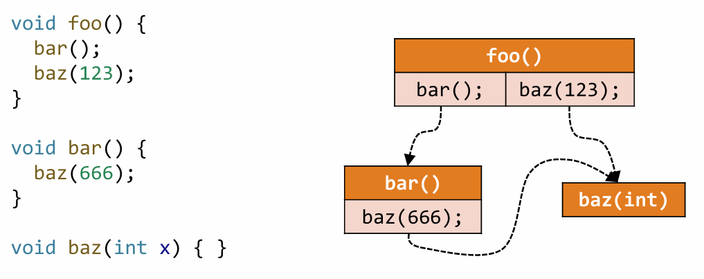
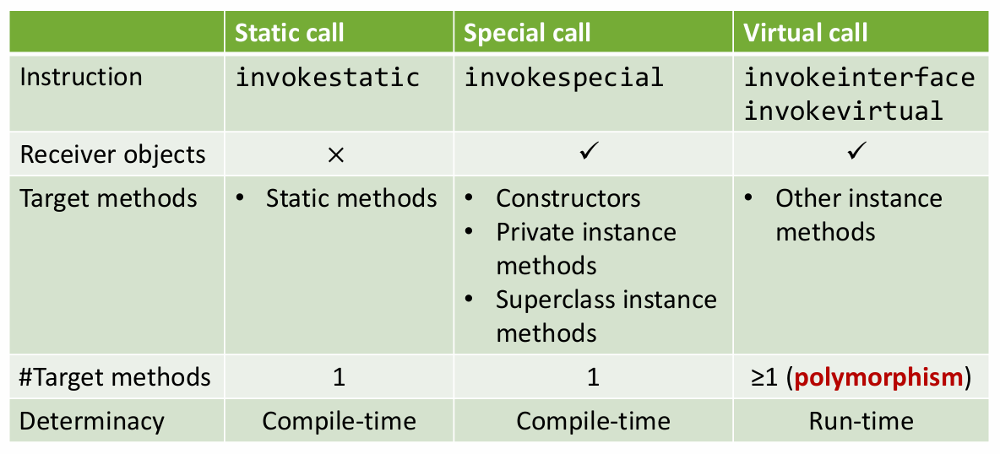
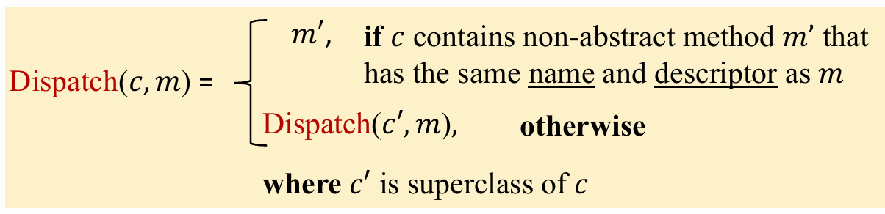
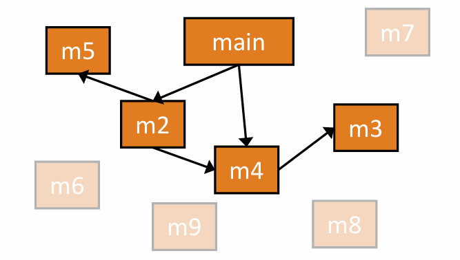
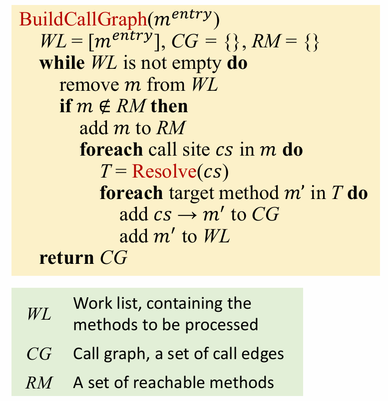
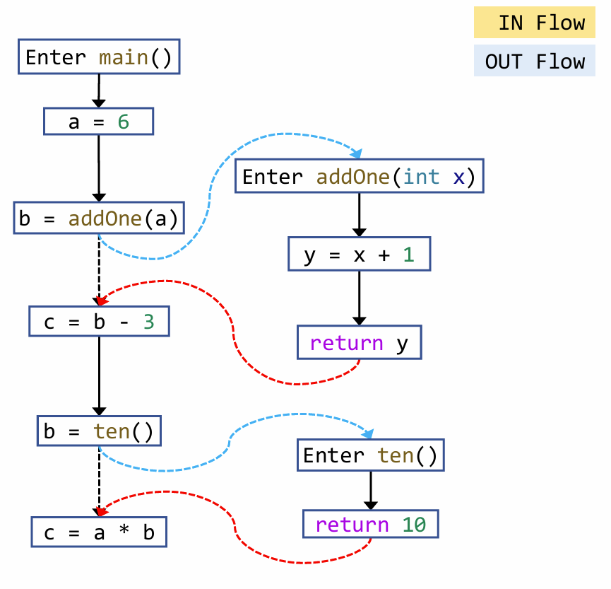

# Interprocedural Analysis

前面的数据流分析大多默认：分析只在单个过程内部进行，函数调用点被当作某种“黑盒”处理。  
但真实程序的行为往往跨越多个方法传播，所以如果只是单纯当成黑盒来看，精确性将大大减少

同时作为面向对象语言，多态的出现也让我们很难唯一确定要调用哪个方法实现，本章将解决这些问题

## 1. Why Use Interprocedural Analysis

先看一个最简单的问题：

```java
int id(int x) {
    return x;
}

void main() {
    int a = 10;
    int b = id(a);
}
```

如果只做过程内分析，那么在 `main` 里看到 `b = id(a)` 时，我们通常只知道这里调用了某个函数，它可能读取某个参数， 它会返回某个值

但如果完全不知道 `id` 的函数体，就很难推出 `b = 10`。  
也就是说，**信息在调用点被截断了**。

过程间分析要解决的，正是这种“信息跨过程传播”的问题：

我们要知道实参如何流入被调函数，被调函数内部如何变换信息以及 返回值如何再流回调用点

因此我们需要一种比单个 `CFG` 更大的程序表示，把“方法之间如何调用”也建模出来。


## 2. Call Graph

`Call Graph` 是过程间分析最基础的结构。



它的节点是方法 `method`，边表示：

- 某个方法里存在一个调用点
- 这个调用点在运行时可能调用另一个方法

所以一条边 $m \rightarrow n$ 表示：方法 `m` 里某个调用语句，可能把控制流转移到方法 `n`。

`Call Graph` 的作用至少有两个：

- 找出哪些方法是 `reachable` 的
- 找出每个调用点可能对应哪些目标方法

静态分析里构造的调用图通常不是“精确真实执行图”，而是一个 **sound over-approximation**：即宁可多算一些可能目标，也不能漏掉真正可能发生的调用

因为一旦漏边，后续分析就可能不 sound。

## 3. Java 的三种调用方式

在 Java 中，从过程间分析的角度，常把方法调用分成三类：



### Static Call

`static call` 指静态方法调用。它没有接收者对象，目标在编译期就已经确定。

```java
public class A {
    public static void main(String[] args) {
        A.foo();
    }
    public static void foo() {
        System.out.println("static call");
    }
}
```

因为这里调用的是类 `A` 上的静态方法 `foo`，所以分析器通常可以直接解析到唯一目标 `A.foo`。

### **Special Call**

`special call` 主要包括：

- 构造函数调用 `constructor`
- 私有方法调用 `private method`
- `super` 调用

例如：

```java
public class A {
    public static void main(String[] args) {
        B b = new B(); // 初始化
        b.call();
    }
}

class Parent {
    public void foo() {
        System.out.println("Parent.foo");
    }
}

class B extends Parent {
    public B() { super(); }

    public void call() {
        super.foo();
        privateFoo();
    }

    private void privateFoo() {
        System.out.println("B.privateFoo");
    }
}
```

这类调用虽然可能看起来也有对象参与，但它不需要像虚调用那样根据运行时类型动态分派。这里“唯一确定”的不是运行时对象本身，而是**要调用哪个方法实现**：

- 构造函数不能被重写，所以 `new B()` 只会调用 `B.<init>()`
- `private` 方法不能被子类重写，所以 `privateFoo()` 只会指向当前类里的实现
- `super.foo()` 明确从父类开始查找，所以目标不会再由运行时类型决定

因此，`special call` 通常可以由调用点的静态信息直接确定唯一目标。

###  **Virtual Call**

`virtual call` 是最麻烦的一类，例如：

```java
public class A {
    public static void main(String[] args) {
        Parent p = new Child();
        p.foo();
    }
}

class Parent {
    public void foo() {
        System.out.println("Parent.foo");
    }
}

class Child extends Parent {
    @Override
    public void foo() {
        System.out.println("Child.foo");
    }
}
```

这里真正被调用的方法，不仅取决于变量 `p` 的声明类型 `Parent`，还取决于 **运行时对象的实际类型**。

在这个例子里，`p` 的声明类型是 `Parent`，但运行时实际指向的是 `Child` 对象，所以 `p.foo()` 最终调用的是 `Child.foo()`。

如果运行时 `p` 还可能指向其他 `Parent` 子类对象，并且这些子类都重写了 `foo()`，那么这一次调用就可能落到多个不同目标上。

总结来说：

| 调用方式 | 解析难度 | 关键原因 |
| --- | --- | --- |
| `static call` | 低 | 没有接收者对象，目标静态确定 |
| `special call` | 低 | 不走动态分派，目标通常唯一 |
| `virtual call` | 高 | 需要考虑接收者对象的运行时类型 |

也正因此，构造 `Call Graph` 的核心难点几乎都集中在 `virtual call` 上。


## 4. dispatch 函数

为了描述“一个调用最终会落到哪个方法实现”，课程里通常定义 `dispatch(c, m)`。



`dispatch(c, m)` 的含义是：假设接收者对象的运行时类型是类 `c`，并且要调用的方法签名是 `m`，那么就从 `c` 开始沿着继承链向上查找，返回第一个真正定义了 `m` 的方法实现。

换句话说，它回答的是：如果接收者对象的运行时类型是 `c`，这次调用最终会执行哪一个方法体？


## 5. CHA 算法

`CHA` 是 `Class Hierarchy Analysis`。

它的核心思想很直接：利用类继承结构来解析虚调用。只要某个类在类型层面上可能成为接收者对象的运行时类型，`CHA` 就把它对应的调用目标加入 `Call Graph`。这种做法比较保守，但可以避免漏掉真实可能发生的调用， 即 只要有可能被调用， 就加到调用集里面


对于 `static call` 和 `special call`，目标通常是唯一的，直接解析即可。真正需要 `CHA` 处理的是 `virtual call`。

假设有一个虚调用点：

```java
r = x.k(...)
```

并且 `x` 的声明类型是 `T`。`CHA` 会找出 `T` 以及 `T` 的所有可能子类 `{c}`；对每个候选类 `c`，计算 `dispatch(c, k)`；最后把所有得到的方法都作为这次调用的可能目标。

也就是说，`CHA` 对虚调用的策略本质上是：只要某个类在类型层面上有可能成为接收者运行时类型，就把它对应的分派结果都算进去。


> `CHA` 只看 **类层次**，不看 **对象实际会在哪些程序点被创建、流向哪里**。
>
> 所以它常常会把一些“类型上可能、但程序实际上永远不会发生”的目标也加入调用图。它的优点是快、简单、sound；缺点是比较保守，可能引入很多假边。

## 6. Call Graph 的构建

有了“如何解析一个调用点”的规则之后，就可以构建整张调用图了。整体思路是一个从入口出发的可达性展开过程。



注意，有些函数块可能永远达不到

### 构建算法



用大白话来说明算法的流程：

我们先将入口函数放入工作集中，和BFS一样，每次从工作集中取一个处理，如果这个这个函数不在可达集RM中（这一步判断主要是为了避免重复处理），那么我们将其加入可达集中，并进行以下处理：
* 对这个函数块内所有的程序调用语句进行 CHA 操作，找出可能前往的函数方法集合 `{m}`
    * 将集合 `{m}` 中的方法体加入到调用图 CG 中，并将这个方法放到工作集中

## 7. ICFG

只有 `Call Graph` 还不够，因为它只告诉我们“方法和方法之间可能有调用关系”，却没有把 **过程内控制流** 和 **过程间调用/返回关系** 统一起来。

为此我们需要 `ICFG`，即 `Interprocedural Control Flow Graph`。

`ICFG` 可以理解为：

$$
\text{ICFG} = \text{CFG} + \text{Call Edges} + \text{Return Edges}
$$

也就是说：

- 每个方法内部仍然有自己的 `CFG`
- 在调用点和被调方法入口之间加入 `call edge`
- 在被调方法出口和调用点返回后的位置之间加入 `return edge`

这样，原本分散在不同方法里的控制流就被连成一张更大的图。




在 `ICFG` 中常见的边有：

- `intra-procedural edge`：方法内部普通控制流边
- `call edge`：调用点到被调方法入口
- `return edge`：被调方法出口到调用返回点

注意，`call edge` 只会传递参数的数据流信息，不是函数调用参数的数据流不需要进行处理，这里主要是基于性能的考虑
