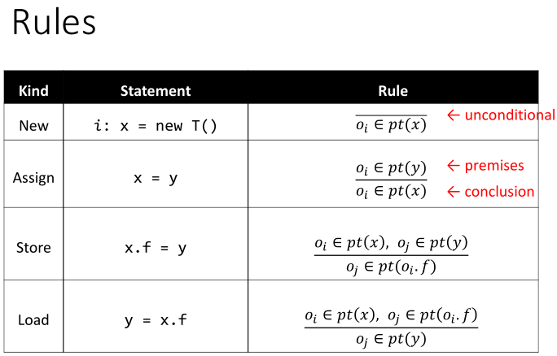
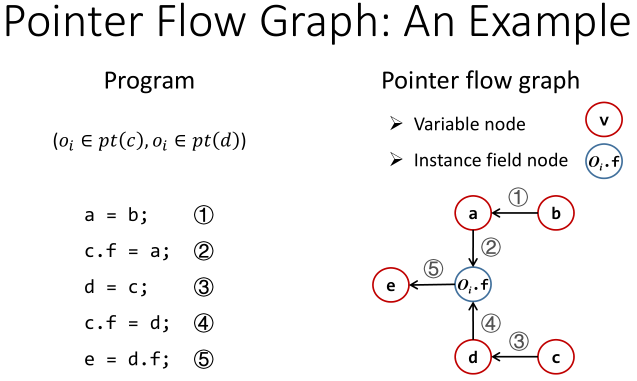
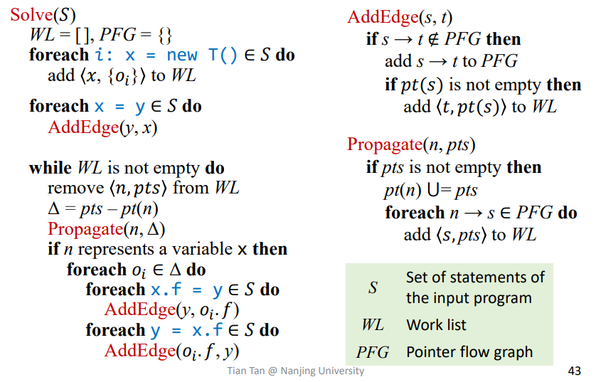
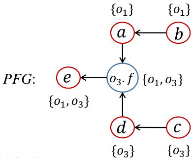
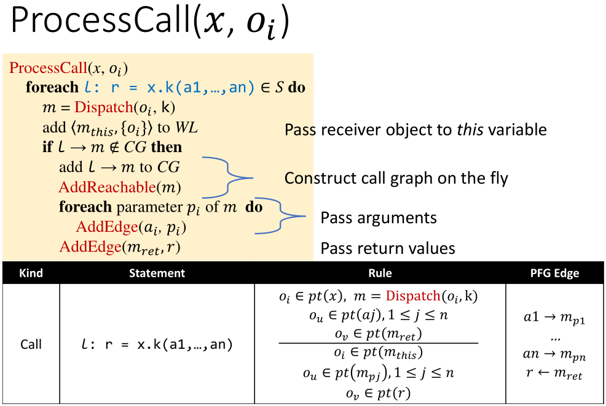

# 指针分析规则和算法

这一节关心两个问题：

1. 如何把指针相关语句翻译成 points-to 约束？
2. 如何用算法求出所有 pointer 的 points-to set？

默认设定仍然是：context-insensitive、flow-insensitive、field-sensitive，并使用 allocation-site abstraction。

## 1. 记号

课程中的基本定义如下：

- 变量：$x,y\in V$
- 字段：$f,g\in F$
- 抽象对象：$o_i,o_j\in O$
- 实例字段：$o_i.f\in O\times F$
- Pointer：变量或实例字段

因此 $Pointer = V \cup (O \times F)$。points-to 函数为 $pt: Pointer \rightarrow \mathcal{P}(O)$，也就是说，每个 pointer 都映射到一个抽象对象集合。

## 2. 规则总览

四类基础语句可以先概括成下面这张表：



`New` 直接产生 points-to fact；`Assign` 可以一开始加入 PFG 边；`Store` 和 `Load` 依赖 base pointer 的 points-to set，需要随着分析逐步展开。

## 3. 基本推导规则

规则的读法是：横线上面是前提，横线下面是结论。只要前提成立，就把结论加入 points-to set。

### New

$$
\frac{i: x = \mathrm{new}\ T()}{o_i \in pt(x)}
$$

第 $i$ 个 allocation site 产生抽象对象 $o_i$，并加入 `x` 的 points-to set。

### Assign

$$
\frac{x = y \quad o_i \in pt(y)}{o_i \in pt(x)}
$$

`x = y` 表示 `y` 指向的对象也会流入 `x`，即 $pt(y) \subseteq pt(x)$。

### Store

$$
\frac{x.f = y \quad o_i \in pt(x) \quad o_j \in pt(y)}{o_j \in pt(o_i.f)}
$$

如果 `x` 可能指向 $o_i$，那么 `x.f = y` 会把 $pt(y)$ 写入 $o_i.f$，即对每个 $o_i\in pt(x)$，都有 $pt(y)\subseteq pt(o_i.f)$。

### Load

$$
\frac{y = x.f \quad o_i \in pt(x) \quad o_j \in pt(o_i.f)}{o_j \in pt(y)}
$$

如果 `x` 可能指向 $o_i$，那么 `y = x.f` 会把 $pt(o_i.f)$ 读到 `y`，即对每个 $o_i\in pt(x)$，都有 $pt(o_i.f)\subseteq pt(y)$。

## 4. 包含约束视角

上面的推导规则也可以看成包含关系：

- `x = y`：$pt(y)\subseteq pt(x)$
- `x.f = y`：对每个 $o\in pt(x)$，有 $pt(y)\subseteq pt(o.f)$
- `y = x.f`：对每个 $o\in pt(x)$，有 $pt(o.f)\subseteq pt(y)$

所以指针分析本质上是在解一组包含约束。

`Assign` 的边可以一开始就确定；`Store` 和 `Load` 的边依赖 base pointer 的 points-to set，需要随着分析逐步展开。

## 5. Pointer Flow Graph



Pointer Flow Graph, PFG 是一个有向图，用来表示对象如何在 pointers 之间流动。

- 节点：变量或抽象字段，例如 `x`、`y`、$o_i.f$
- 边：$p\rightarrow q$ 表示 $pt(p)\subseteq pt(q)$

语句和 PFG 边的关系可以写成：

- `x = y` 加入 $y\rightarrow x$
- `x.f = y` 对每个 $o_i\in pt(x)$ 加入 $y\rightarrow o_i.f$
- `y = x.f` 对每个 $o_i\in pt(x)$ 加入 $o_i.f\rightarrow y$

如果 PFG 上存在从 `p` 到 `q` 的路径，那么 `p` 指向的对象可能最终流到 `q`。因此求解 points-to set 可以理解成在 PFG 上传播对象。

## 6. 为什么 PFG 要动态更新

字段边依赖 base pointer。

```java
c.f = a;
e = d.f;
```

只有当分析发现 $o_i\in pt(c)$ 且 $o_i\in pt(d)$ 时，才能加入 $a\rightarrow o_i.f$ 和 $o_i.f\rightarrow e$。

因此构建 PFG 和传播 points-to 信息是相互依赖的：

1. 传播产生新的 points-to fact
2. 新 fact 让更多字段边可以被加入
3. 新边又触发更多传播

## 7. Worklist 算法



简单的描述一下 propagate 函数，实际上是将新增的信息从源点一直往下流，直到流不动为止

`AddEdge` 需要注意已经存在的 points-to 信息：如果新边加入后不传播 $pt(s)$ 中已有的对象，就会漏掉旧 fact。

## 8. 为什么只传播 $\Delta$

假设当前 $pt(x)=\{o_1,o_2\}$，worklist 取出 $pts=\{o_2,o_3\}$，真正新增的只有 $\Delta=pts-pt(x)=\{o_3\}$。

旧对象已经沿着 `x` 的后继边传播过，重复传播只会浪费时间。

这样做有两个好处：

- 避免重复工作，算法更快
- 每个 points-to fact 只会从“未知”变成“已知”一次，因此最终会停下来

## 9. 小例子

```java
b = new C(); // o_1
a = b;
c = new C(); // o_3
c.f = a;
d = c;
c.f = d;
e = d.f;
```



## 10. 过程间指针分析

加入方法调用后，指针分析和调用图构建互相依赖：

- 解析虚调用需要 receiver 的 points-to set
- 新的调用边会让更多方法变成 reachable
- 新方法中的语句又会产生新的 points-to facts

所以过程间指针分析不能简单地分成两步：

1. 先把完整 Call Graph 建好
2. 再沿着 Call Graph 做指针分析

原因是：虚调用的目标方法本身就依赖指针分析结果。

```java
interface I {
    void foo();
}

class A implements I {
    public void foo() {}
}

class B implements I {
    public void foo() {}
}

void main() {
    I x = new A(); // o1
    x.foo();
}
```

如果只看声明类型 `I`，`x.foo()` 可能调用所有实现了 `I.foo` 的方法；但如果指针分析知道 $pt(x)=\{o_1\}$，并且 $o_1$ 的类型是 `A`，那么这个调用点只需要连到 `A.foo`。

因此课程采用 on-the-fly call graph construction：

> 一边传播 points-to 信息，一边根据新发现的 receiver object 解析虚调用，并把新方法加入分析范围。

这里有两个关键集合：

- `RM`：reachable methods，当前已经确认可达的方法
- `S`：reachable methods 里的语句集合

注意，`S` 不是全程序所有语句。只有当一个方法进入 `RM` 后，它的方法体才会加入 `S`，其中的 `new`、赋值、字段读写和调用语句才会参与分析。

## 11. 调用语句如何变成 PFG 边


这张图里的规则可以从左到右读。

调用语句是：

```java
l: r = x.k(a1, ..., an)
```

其中 `l` 是调用点，`x` 是 receiver，`k` 是要调用的方法名，`a1 ... an` 是实参，`r` 是接收返回值的变量。

规则上半部分是前提：

- $o_i \in pt(x)$：receiver `x` 可能指向对象 $o_i$
- $m = Dispatch(o_i, k)$：根据 $o_i$ 的动态类型，解析出真正可能调用的目标方法 `m`
- $o_u \in pt(a_j)$：第 `j` 个实参 `a_j` 可能指向对象 $o_u$
- $o_v \in pt(m_{ret})$：目标方法 `m` 的返回变量可能指向对象 $o_v$

规则下半部分是结论：

- $o_i \in pt(m_{this})$：receiver 对象流入被调方法的 `this`
- $o_u \in pt(m_{p_j})$：第 `j` 个实参对象流入第 `j` 个形参
- $o_v \in pt(r)$：被调方法的返回对象流回调用点左侧变量 `r`

换成 PFG 边就是：

- receiver 传给 `this`：$x \rightarrow m_{this}$
- 实参传给形参：$a_j \rightarrow m_{p_j}$
- 返回值传回调用点：$m_{ret} \rightarrow r$

大白话说，这条规则做了两件事：先用 `pt(x)` 里的对象决定 `x.k(...)` 到底可能调用哪个方法；一旦目标方法 `m` 确定，就把调用者和被调方法之间的参数、`this`、返回值连接起来。

过程间分析的核心，就是把调用点两边的信息连起来。课程这里主要讨论 virtual call：它的目标不能只看语法确定，需要结合 receiver 的 points-to set。

如果后面又发现新的 receiver object，例如 $o_j\in pt(x)$，就要再执行一次 dispatch，可能加入新的调用边。


## 12. 过程间算法框架

整体上需要维护：

- `WL`：待传播的 points-to 增量
- `PFG`：Pointer Flow Graph
- `CG`：Call Graph
- `RM`：reachable methods
- `S`：当前 reachable methods 中的语句集合

先用大白话描述一下流程：

1. 从 `main` 开始，把 `main` 加入 reachable methods
2. 扫描 `main` 的语句，把 `new` 产生的对象放入 worklist，把普通赋值变成 PFG 边
3. worklist 每传播出一个新的 points-to fact，就检查这个变量相关的字段读写和调用点
4. 如果某个虚调用因为新 receiver object 解析出新目标，就把目标方法加入 reachable methods
5. 新方法加入后，又会带来新的语句、新的对象、新的 PFG 边
6. 重复直到 worklist 为空，Call Graph 和 points-to sets 同时达到不动点

核心伪代码：


### AddReachable

`AddReachable(m)` 的作用是：当一个方法第一次被发现可达时，把它的方法体纳入分析。

这里要注意：新方法刚加入时，里面已经能确定的语句要立刻处理。

- `new` 语句产生初始 points-to fact
- `assign` 语句产生确定的 PFG 边
- `virtual call` 要等 receiver 的 points-to set 被发现后再解析目标

### ProcessCall

`ProcessCall(x, o_i)` 的作用是：当变量 `x` 新增一个 receiver object $o_i$ 时，检查所有以 `x` 为 receiver 的虚调用。




这里的关键是：同一个调用点可能对应多个目标方法。每次发现新的 receiver object，都可能通过 `Dispatch` 解析出一个新目标。

它做了两件事：

- 在 Call Graph 中记录 `l -> m`
- 在 PFG 中加入参数、`this`、返回值之间的传播边

所以 Call Graph 负责说明“谁可能调用谁”，PFG 负责说明“对象如何跨方法流动”。
